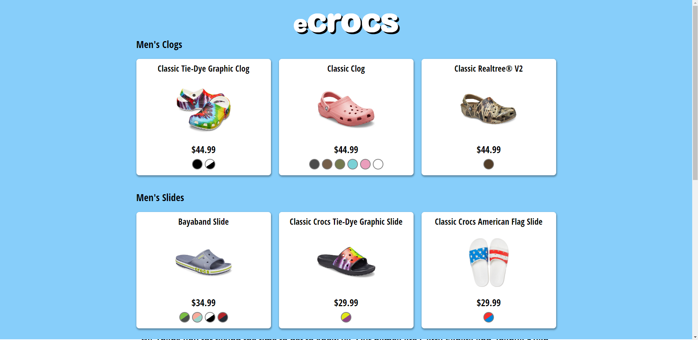
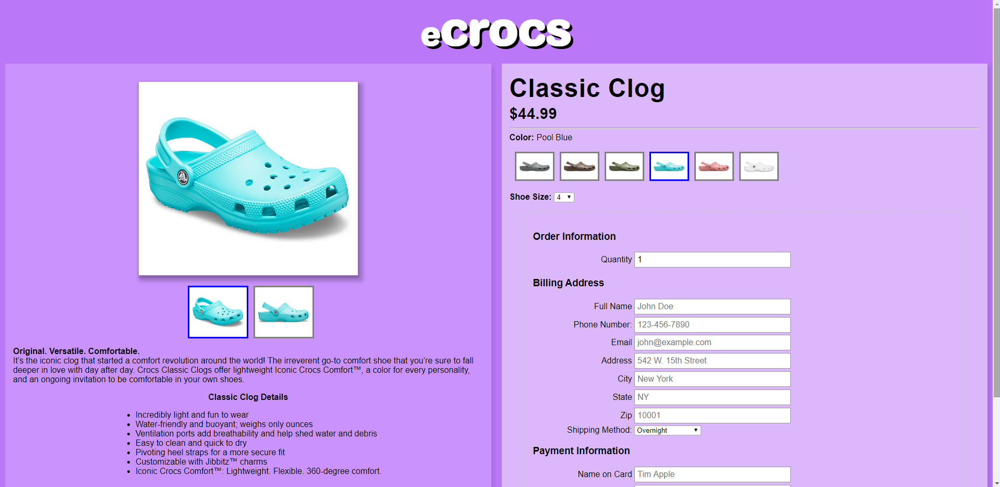

# IN4MATX 124

## Project 1

```
Members:
Joshua Kuan (52594796)
Garry Fanata (39583521)
```

We are group 13, our project is hosted on circinus-13.

URL: `http://circinus-13.ics.uci.edu/inf124-proj1/index.html`
Github Repo: `https://github.com/cwjoshuak/inf124-ecommerce`

Our site consists of 3 main pages

- the home page: index.html
- products list page: products.html
- individual product page: product.html

### Requirement Satisfaction

1. Our business is eCrocs. Our company vision, motto and team are outlined on the home page.
2. We have a list of 12 products which were handpicked and stored in shoes.json. This is displayed on the products.html page.
3. See 4.
4. On the products.html page, the products are displayed in a table, in a card format. Each card contains the title, image, price and color varieties of the product
5. Clicking on any part of a product card will link the user to the respective product page, containing detailed information regarding the product they clicked on.
6. The detailed product page contains a form for the customer to input their important details, and choose the size and quantity before purchasing.
7. Submission of the form will open up the default mail client, prefilled with To, Subject and message content.
8. All form fields are checked with HTML validation. A prompt is displayed if any of the validation checks fail.
9. Our website uses more than 10 different stylistic properties of CSS. We have customized background colors, margin, padding, border radius, shadows, container/image sizes, fonts, etc.
10. We use the CSS:hover property to increase the size of the images when the mouse is over it. We also demonstrate the JavaScript mouseenter, mouseleave events to detect and change images when the user mouses over a different color on the products list page.
11. Name and Student ID of group members are in the About Us section of the home page

### Screenshots





#### Notes:

Some code was adapted from adapted from [MDN's Your First Form](https://developer.mozilla.org/en-US/docs/Learn/Forms/Your_first_form)
